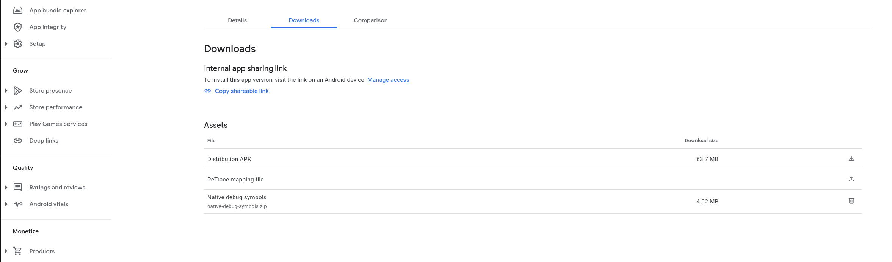

# ICSee

<p align="center">

</p>

ICSee is an application that helps people with visual impairments see more clearly. It is developed
by [SciFY](https://scify.org/en).

We created an application that allows people with visual impairments to read!

You can watch a video of the application in action [here](https://www.youtube.com/watch?v=Wb4_S6ngTjM&feature=youtu.be).

With ICSee:

* The user can simply point their smartphone/tablet’s camera to what they want to take a better look at, and they see a
  processed, clearer image on their screen.
* In this way, they can read a small text (e.g. the check or menu at a restaurant, the charge amount on the taxi meter,
  the name on a doorbell).

How does it work? ICSee:

* processes the image/video from a smartphone/table’s camera in real-time,
* applies a series of filters, and
* projects a result that’s easier to read or identify on the screen.

## Abstract

It is an application for small portable devices (smart phones, tablets) that will help people with severe visual
impairments see more clearly.
How? The user simply directs the camera of his/her smartphone or tablet to the point he/she wants and… that was it! The
application processes the image on the screen according to the user’s needs (conversion to negative or greyscale,
increase the contrast, etc.) and provides in real time an image that is is easier for the user to see!
Who is it for?
It is intended to be used by people with severe visual impairments.
The Application provides an audio tutorial when starting.

## Implementation

The ICSee project involves a software solution for Android hand-held devices.
We can support filtering on a camera-streamed image (real-time), applying a wide variety of filters on it.

## Compilation - Requirements

The minimum SDK version is 16 (Android 4.1).
A device with a camera is required. For the auto-focus feature, the camera should support auto-focus.
This is a Gradle-based project. The required Open-CV library is included in the Android project (see `app/build.gradle`
file).

## Properties files setup

Make sure to add a `secrets.properties` file in the root project directory. Initially, this file should look like this:

```text
SHAPES_DATALAKE_KEY=
```

Also make sure that a `SENTRY_DSN` variable exists in `secrets.properties`. If you use Sentry, you can put the Sentry
DSN value there:

Example:

```text
SHAPES_DATALAKE_KEY=
SENTRY_DSN="https://test@sentry.test.org/1"
```

In addition, make sure to make a copy of `sentry.properties.example`:

```bash
cp sentry.properties.example sentry.properties
```

And fill out the fields in the file.

## Deployment

This Application is deployed as a normal Android app.

When you upload a new version to the Play Store, make sure to update the version code and version name in the
`app/build.gradle` file.

Also, you will need to upload the mapping file, as well as the native symbols to Google Play Developer Console.

To do this, navigate to the "App Bundle Explorer" section of the Play Console, and click on the "Downloads" tab:



1. For the ReTrace mapping file, click on the "Upload" button and upload the mapping file that is generated by the build
   process. This file is located in the `app/build/outputs/mapping/release/mapping.txt` directory.
2. For the native symbols, navigate to the `[YOUR_PROJECT]\build\app\intermediates\merged_native_libs\release\out\lib`
   directory, and create a .zip file (the name does not matter), which will contain these directories: `arm64-v8a`,
   `armeabi-v7a`, `x86_64`. Then, upload this .zip file to the Play Console.

## Main Technologies

<a href="http://opencv.org/"></a>

[1]: http://www.scify.gr/site/en/projects/in-progress/icsee

## LICENSE

Copyright 2022

Licensed under the Apache License, Version 2.0 (the "License");
you may not use this file except in compliance with the License.
You may obtain a copy of the License at

    http://www.apache.org/licenses/LICENSE-2.0

Unless required by applicable law or agreed to in writing, software
distributed under the License is distributed on an "AS IS" BASIS,
WITHOUT WARRANTIES OR CONDITIONS OF ANY KIND, either express or implied.
See the License for the specific language governing permissions and
limitations under the License.

## Sponsors

<table>
<tr>
<td>
<a href="http://www.scify.gr/en/" title="SciFY website" rel="home" target="_blank"></a>
</td>
<td>
<a href="http://www.latsis-foundation.org/" title="Ίδρυμα Λάτση" rel="home" target="_blank"></a>
</td>
<td>
<a href="https://shapes2020.eu/" title="SHAPES EU Project" rel="home" target="_blank"></a>
</td>
</tr>
</table>
